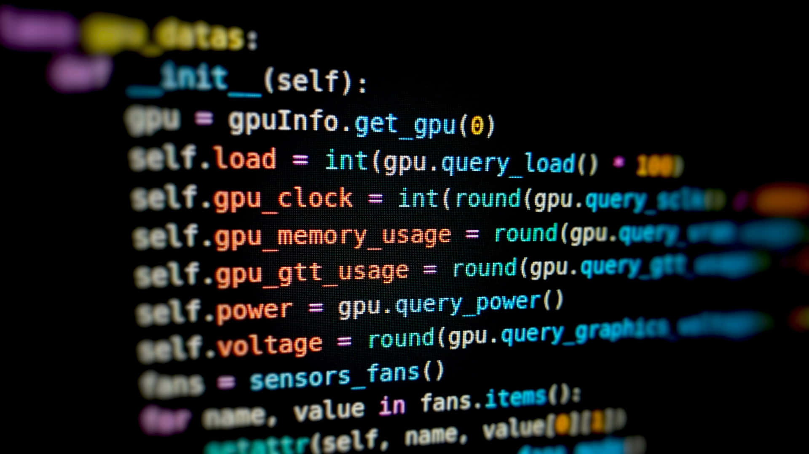

  

<h1 align="center">Hi , I'm Fabiana </h1>

  

 

<h1> 🛠️ My Skills</h1>

<picture>   </picture> Programming languages
 
 

  

<picture>   </picture> Frontend Development
 
 

  

<picture>   </picture> Software & Tools
 
 

  

<picture>   </picture> IDEs
 
 

  

